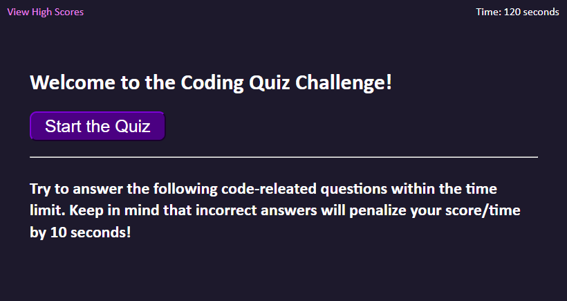

# Coding-Quiz-Challenge

## Description

A short timed quiz relating to Javascript composed of multiple choice questions
designed as a mock coding accessment.


## Installation

Once the repo has been downloaded, you can open the webpage by opening on the index.html file

## Usage

https://monstergog.github.io/Coding-Quiz-Challenge/

When you are ready to start the quiz, press the button. Answer each multiple choice question as they appear. You will be penalized 10 seconds to the timer which also acts as your end score. Submit your initials and score to the high score board once the quiz is complete. You may view the list of high scores with the link on the top left.



## Credits

Questions and Solutions From:
https://www.interviewbit.com/javascript-mcq/

Sorting Function Based on ChatGPT Sorting Code: https://openai.com/blog/chatgpt
```javascript
const names = ['John', 'Alice', 'Bob', 'Mary'];
const ages = [25, 20, 30, 28];

const people = names.map((name, index) => ({ name, age: ages[index] }));
people.sort((a, b) => a.age - b.age);

const sortedNames = people.map(person => person.name);
const sortedAges = people.map(person => person.age);

console.log(sortedNames); // ['Alice', 'John', 'Mary', 'Bob']
console.log(sortedAges); // [20, 25, 28, 30]
```

Numbers for Ordered List Within Buttons / High Scores:
https://stackoverflow.com/questions/62792415/buttons-numbered-as-li-in-ol


## License

N/A

---